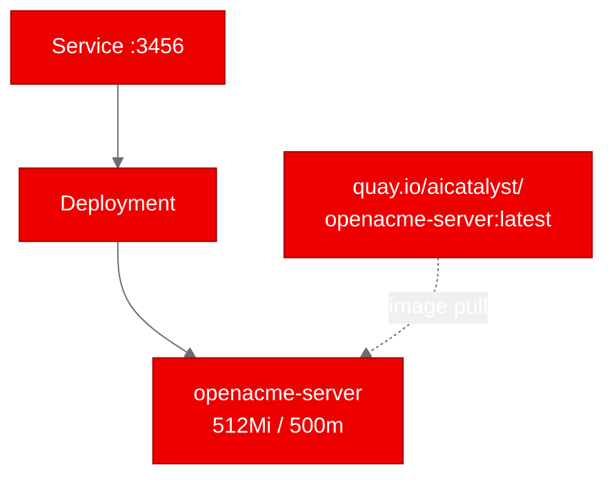

## Deploying a Multi-Agent AI Platform on OpenShift: Lessons from openacme

We recently took openacme, a multi-agent AI workforce platform built with TypeScript, and deployed it on OpenShift using UBI-based containers. The process was straightforward in concept but surfaced two real problems that are worth talking about: filesystem permissions in constrained containers and server host binding defaults that silently break Kubernetes networking.

Here's what we did, what broke, and how we fixed it.

## What is openacme?

openacme is a TypeScript monorepo that combines a Hono server backend with a React 19 frontend (built with Vite). It uses Vercel AI SDK to connect to LLM providers and stores data in SQLite through drizzle-orm. The whole thing runs on Node.js 22 with pnpm 9 managing the monorepo workspace.

In short, it's a modern LLM-powered application with a clean separation between server and client. That makes it a good candidate for containerized deployment because the server component is self-contained and listens on a single port (3456).

## Why deploy it on OpenShift?

We wanted to prove that a pnpm-based TypeScript monorepo, specifically one that integrates LLM APIs, can run on OpenShift without major modifications. OpenShift enforces stricter security constraints than vanilla Kubernetes. Containers run as non-root by default under the restricted Security Context Constraint. That's a good thing for production, but it means your container build process has to be permission-aware from the start.

We also wanted to validate the deployment end-to-end: build the image, push it to a registry, deploy it with standard Kubernetes manifests, and confirm the application actually responds to requests.

## Containerizing with UBI

We used `registry.access.redhat.com/ubi9/nodejs-22` as the base image. UBI (Universal Base Image) gives us a Red Hat-supported foundation that's compatible with OpenShift's security model. The Dockerfile follows a standard pattern: copy the source, install dependencies, build, and set the runtime user to 1001.

The first challenge hit us during `pnpm install`. The pnpm store directory wasn't writable by the non-root user because we hadn't set the right group permissions before running the install. OpenShift runs containers with an arbitrary user ID that belongs to the root group (group 0), so the fix was to run `chgrp -R 0` and `chmod -R g=u` on the application directory before the install step. This gives the root group the same permissions as the owning user, which is exactly what OpenShift expects.

This is a pattern you'll see in every UBI-based Dockerfile that needs to write files at build time as a non-root user. It's not optional on OpenShift.

## The Host Binding Problem

After fixing permissions, the image built and pushed cleanly to `quay.io/aicatalyst/openacme-server:latest`. We deployed it to a `poc-openacme` namespace with a simple Deployment and ClusterIP Service on port 3456. The pod started, the logs looked healthy, but the health check failed.

The problem: Hono's default configuration binds the server to `127.0.0.1`. That's localhost only. Inside a Kubernetes pod, the Service routes traffic to the pod's IP address, not to localhost. So the server was running fine but refusing connections from anything outside the container itself.

The fix was to create a `config.yaml` in the application's data directory that sets the host to `0.0.0.0`. This tells Hono to listen on all network interfaces, which is what you need for Kubernetes Services to reach the application.

This is a common gotcha with web frameworks that default to localhost binding. It works perfectly in local development but silently breaks in containers. If your pod starts but your Service can't reach it, check the bind address first.

## Deploying to the Cluster

The deployment itself was minimal. We created:

- A Namespace (`poc-openacme`)
- A Deployment with one replica, requesting 512Mi of memory and 500m CPU
- A ClusterIP Service exposing port 3456

No PVCs, no GPUs, no sidecars. openacme's server component is stateless at the HTTP layer (SQLite stores data on the local filesystem, which is ephemeral in this setup). For a PoC, that's fine. For production, you'd swap SQLite for PostgreSQL with a PersistentVolumeClaim or a managed database.

## Running the Tests

We ran two validation scenarios against the deployed service at `http://server.poc-openacme.svc.cluster.local:3456`:

| Scenario | Result | Duration |
|---|---|---|
| health-check | PASS | 0.02s |
| home-page | PASS | 0.01s |

Both passed on the first attempt after the host binding fix. Response times were under 20ms, which is expected for a Node.js server with no downstream dependencies during these basic checks.

The 100% pass rate confirmed that the container is correctly built, the server starts without errors, and Kubernetes networking routes traffic as expected.

## What We Learned

Three takeaways from this deployment:

**1. Permission patterns are not optional on OpenShift.** If you're building with UBI and running as a non-root user, you must set group permissions before any step that writes to the filesystem. The `chgrp -R 0 && chmod -R g=u` pattern should be part of your muscle memory for OpenShift Dockerfiles.

**2. Always check the bind address.** Framework defaults that work in development can silently break in containers. Hono, Express, Fastify, and others may default to `127.0.0.1`. For Kubernetes, you need `0.0.0.0`. Check your framework's configuration and set it explicitly.

**3. pnpm monorepos work fine in containers.** Despite the initial permission issue, once the filesystem permissions were correct, pnpm installed and built the workspace without any monorepo-specific problems. The workspace protocol and dependency hoisting worked as expected inside the UBI container.

## Try It Yourself

The fork is available at [github.com/aicatalyst-team/openacme](https://github.com/aicatalyst-team/openacme) with the UBI Dockerfile and Kubernetes manifests included. To reproduce this deployment:

1. Build the image: `podman build -t openacme-server -f Dockerfile.ubi .`
2. Push to your registry
3. Apply the manifests from the `kubernetes/` directory to your OpenShift cluster
4. Verify with a health check against the Service endpoint

If you're running a TypeScript application with pnpm and wondering whether it works on OpenShift, the answer is yes. Just watch your permissions and bind addresses.
