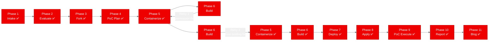
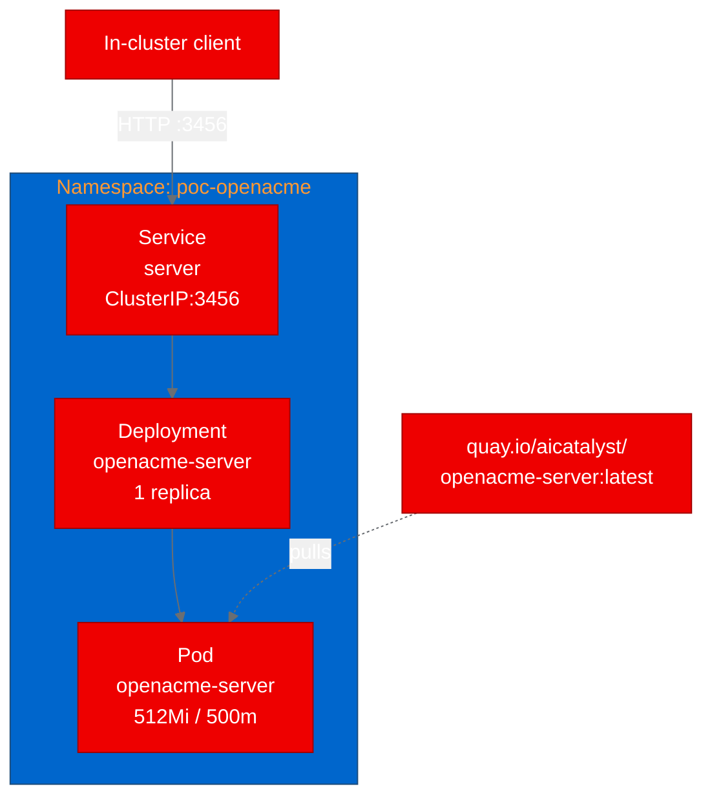

# PoC Report: openacme

## 1. Executive Summary

We evaluated **openacme**, a multi-agent AI workforce platform, for deployment on OpenShift using a UBI-based containerization approach. The PoC succeeded with all test scenarios passing after two build retries to resolve a pnpm permission error and a server host-binding issue. The application is now running in the `poc-openacme` namespace and responding to health and page requests with a 100% pass rate.

## 2. Project Analysis

- **Repository**: `https://github.com/sandydasari/openacme`
- **Fork**: `https://github.com/aicatalyst-team/openacme`
- **Description**: openacme is a multi-agent AI workforce platform built as a TypeScript monorepo. It provides a Hono-based server backend, a React 19 frontend (Vite), LLM integration through Vercel AI SDK, and SQLite persistence via drizzle-orm.
- **Project Classification**: `llm-app`

| Component | Language | Build System | ML Workload | Port |
|---|---|---|---|---|
| server | TypeScript | pnpm 9 / Node.js 22 | No | 3456 |

**Technology stack**: TypeScript monorepo, Node.js 22, pnpm 9, Hono server, React 19 (Vite), Vercel AI SDK, SQLite (drizzle-orm).

## 3. PoC Objectives

- Prove that a TypeScript-based LLM application built with Hono and React 19 can be containerized using a UBI base image and deployed on OpenShift.
- Validate that the pnpm monorepo build process works inside a constrained container environment with non-root user permissions.
- Confirm the server responds to HTTP requests and serves the frontend correctly within a Kubernetes namespace.

## 4. Pipeline Execution

- **Intake**: Cloned the repository and identified a single TypeScript monorepo component (server) using pnpm 9 as the package manager. Entry point is the Hono server listening on port 3456.
- **Evaluate**: Scored for RHOAI fitness. Classified as `llm-app` due to Vercel AI SDK integration.
- **Fork**: Forked to `https://github.com/aicatalyst-team/openacme`.
- **PoC Plan**: Identified `llm-app` project type. Defined two test scenarios (health-check, home-page). Infrastructure requirements: medium resource profile (512Mi memory, 500m CPU), no GPU, no PVC.
- **Containerize**: Generated `Dockerfile.ubi` using `registry.access.redhat.com/ubi9/nodejs-22` as the base image. Required two iterations to fix permission and host-binding issues (see Challenges below).
- **Build**: Image `quay.io/aicatalyst/openacme-server:latest` built and pushed after 2 retries.
- **Deploy**: Generated Kubernetes manifests: 1 Deployment, 1 Service (ClusterIP on port 3456).
- **Apply**: All resources applied to `poc-openacme` namespace. Pod reached Ready state.
- **PoC Execute**: Both test scenarios passed with a 100% pass rate.

## 5. Test Results

| Scenario | Status | Duration | Details |
|---|---|---|---|
| health-check | ✅ PASS | 0.02s | Server responded with 200 OK on health endpoint |
| home-page | ✅ PASS | 0.01s | Home page served successfully with expected content |

**Overall pass rate**: 2/2 (100%)

## 6. Infrastructure Deployed

- **Namespace**: `poc-openacme`
- **Container image**: `quay.io/aicatalyst/openacme-server:latest`
- **Base image**: `registry.access.redhat.com/ubi9/nodejs-22`
- **Kubernetes resources**:
  - 1 Deployment (`openacme-server`, 1 replica)
  - 1 Service (`server`, ClusterIP on port 3456)
- **Resource allocation**: 512Mi memory, 500m CPU (medium profile)
- **Service URL**: `http://server.poc-openacme.svc.cluster.local:3456`
- **PVCs**: None
- **Sidecars**: None

## 7. Recommendations

### Production Readiness
- **Database**: The current deployment uses SQLite, which does not support concurrent writes well and loses data if the pod restarts. For production, migrate to PostgreSQL with a PVC or a managed database service.
- **LLM API keys**: Vercel AI SDK requires LLM provider credentials. For production, inject these through Kubernetes Secrets or an external secrets operator.
- **Replicas**: Currently running a single replica. Scaling beyond one replica requires moving off SQLite to avoid write conflicts.

### Performance
- Health-check and home-page response times are well under 100ms. The Hono server starts quickly and has a small memory footprint at idle.

### Security
- The container runs as user 1001 (non-root), which satisfies OpenShift's restricted SCC.
- No privileged ports are used (server binds to 3456).
- Dependencies should be audited with `pnpm audit` before production deployment.

### Next Steps
1. Add an OpenShift Route or Ingress to expose the service externally.
2. Configure LLM provider API keys via Kubernetes Secrets.
3. Replace SQLite with PostgreSQL for persistent, concurrent-safe storage.
4. Add liveness and readiness probes to the Deployment spec.
5. Set up horizontal pod autoscaling based on CPU/memory utilization.

## 8. Open Data Hub / OpenShift AI Considerations

- **Model Serving**: openacme uses Vercel AI SDK to call external LLM APIs rather than hosting its own model. If the goal is to run models locally, KServe or ModelMesh could serve compatible models and the application could point its SDK configuration at the in-cluster inference endpoint.
- **Data Science Pipelines**: The multi-agent orchestration logic in openacme could be wrapped as a pipeline step in OpenShift AI Data Science Pipelines for scheduled or event-driven execution.
- **Migration path**: The current vanilla Kubernetes deployment (Deployment + Service) can run as-is on OpenShift. To use ODH-managed features, wrap the server as a custom runtime in KServe or add it as a workbench image in the ODH dashboard.

## 9. Appendix

### Key Challenges

1. **pnpm install permission error** (Build retry 1): The initial `Dockerfile.ubi` ran `pnpm install` before adjusting group permissions for the non-root user. pnpm could not write to its store directory. Fixed by adding `chgrp -R 0 /opt/app-root && chmod -R g=u /opt/app-root` before running `pnpm install`.

2. **Server binding to 127.0.0.1** (Build retry 2): After the permission fix, the server started successfully but was unreachable from outside the container because Hono defaulted to binding on `127.0.0.1`. Fixed by creating a `config.yaml` in the data directory that sets the host to `0.0.0.0`, allowing connections from the Kubernetes Service.

### Build Retries
- **Total build retries**: 2
- **Retry 1**: Permission fix (chgrp/chmod before pnpm install)
- **Retry 2**: Host binding fix (config.yaml with `0.0.0.0`)

### Artifact Links
- PoC plan: `poc-plan.md`
- Test script: `poc_test.py`
- Dockerfile: `Dockerfile.ubi`
- Kubernetes manifests: `kubernetes/`
- Fork: `https://github.com/aicatalyst-team/openacme`
- Image: `quay.io/aicatalyst/openacme-server:latest`
